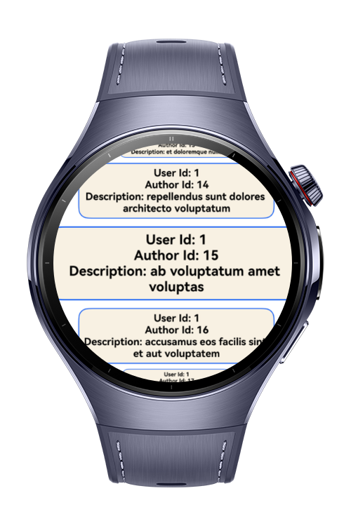
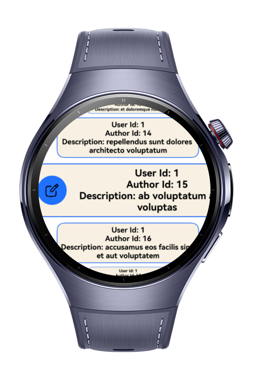

> **Note:** To access all shared projects, get information about environment setup, and view other guides, please visit [Explore-In-HMOS-Wearable Index](https://github.com/Explore-In-HMOS-Wearable/hmos-index).

# How To Make Book List 

This app serves as the home screen of the BookListApp, built using ArkTS and ArkUI. It dynamically fetches and displays book data from a remote API in a scrollable list with interactive swipe actions.

# Preview

<div>


</div>

# Use Cases

When users open the page, the app performs an HTTP GET request to retrieve a list of book-like items. Each entry is rendered dynamically, allowing users to browse, interact, and manage their book collection efficiently within the app.

# Tech Stack

- **Languages**: ArkTS
- **Frameworks**: HarmonyOS SDK 5.1.0(18)
- **Tools**: DevEco Studio Vers 5.1.0.842
- **Libraries**: @kit.RemoteCommunicationKit, @kit.ArkUI

# Project Directory
   ```
   entry/src/main/ets/
    ├── pages/     
    │ ├── Index.ets                           // Home Page
   ```

# Constraints and Restrictions
## Suported Devices
- Huawei Watch 5

# Limitations
- Remote Communication Kit is not working on the previewer.

# License
**BookList** is distributed under the terms of the MIT License
See the [LICENSE](./LICENSE) for more information.